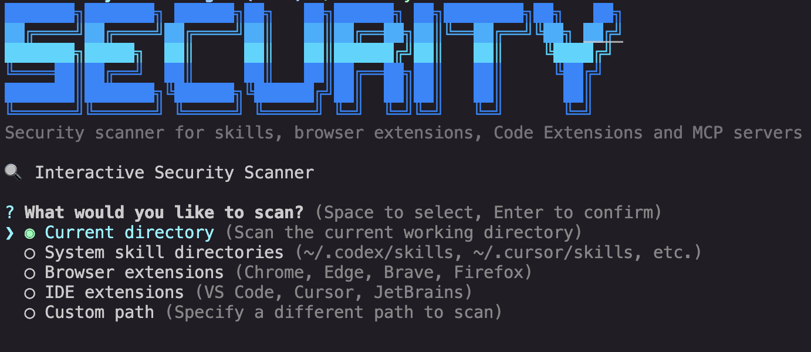

# Teminal Based Security Scanner



High-performance security scanner for agent skills, browser extensions, IDE extensions, and MCP servers. Built with Bun + TypeScript.

## Features

- **Fast Scanning**: Parallel processing, indexed rules, intelligent caching
- **Confidence Scoring**: AI-powered confidence scores (0-100%) to reduce false positives
- **Interactive Mode**: Guided CLI for target selection and configuration
- **Multiple Targets**: Skills, browser extensions, IDE extensions, MCP servers
- **Flexible Output**: Table, JSON, SARIF, HTML reports
- **Smart Detection**: Signature-based + heuristic analysis for secrets, injections, and malicious patterns

## Quick Start

```bash
# Basic scan
securityscanner scan .

# Interactive mode (recommended)
securityscanner interactive

# With confidence filtering
securityscanner scan . --show-confidence --min-confidence 0.7

# Scan system directories
securityscanner scan . --system

# Generate HTML report
securityscanner scan . --report-dir ./reports
```

## Installation

```bash
bun install
bun run build
```

Binary: `./securityscanner`

## Common Commands

```bash
# Scan current directory
securityscanner scan .

# Interactive mode
securityscanner i

# Scan with extensions
securityscanner scan . --extensions --ide-extensions

# Show confidence scores
securityscanner scan . --show-confidence

# Filter by confidence (70%+)
securityscanner scan . --min-confidence 0.7

# Generate reports
securityscanner scan . --report-dir ./reports --report-format html,json

# Save results with tags
securityscanner scan . --save --tag "release-check"

# MCP server scan
securityscanner mcp remote https://your-server/mcp

# View history
securityscanner history
```

## Confidence Scoring

Confidence indicators help prioritize findings:

- **● 80-100%** (Green) - High confidence, likely valid
- **◐ 60-79%** (Cyan) - Medium confidence, review recommended  
- **◑ 40-59%** (Yellow) - Low confidence, may be false positive
- **○ 0-39%** (Red) - Very low confidence, likely false positive

```bash
# Show confidence scores
securityscanner scan . --show-confidence

# Only show high-confidence findings (70%+)
securityscanner scan . --min-confidence 0.7
```

## Interactive Mode

Guided workflow for target selection and configuration:

```bash
securityscanner interactive
# or
securityscanner i
```

**Features:**
- Multi-select targets with keyboard navigation
- Configure all options through prompts
- Visual feedback and color-coded UI
- Confidence scoring options

**Keyboard Controls:**
- `↑/↓` - Navigate
- `Space` - Toggle selection
- `Enter` - Confirm
- `Ctrl+C` - Cancel

## Performance Configuration

```bash
# Parallel scanning (default: enabled)
export SCANNER_PARALLEL_ENABLED=true
export SCANNER_PARALLEL_WORKERS=8

# File caching (default: enabled)
export SCANNER_CACHE_ENABLED=true

# Storage backend (json or sqlite)
export SCANNER_STORAGE_BACKEND=sqlite
```

**Performance gains:**
- Parallel: 3-5x faster on multi-core systems
- Caching: 90%+ speedup for unchanged files
- SQLite: 10-100x faster history queries

## Output Formats

**Table** (default)
```bash
securityscanner scan .
```

**JSON**
```bash
securityscanner scan . --format json
```

**SARIF** (for CI/CD)
```bash
securityscanner scan . --format sarif --output results.sarif
```

**HTML Reports**
```bash
securityscanner scan . --report-dir ./reports
```

## Exit Codes

- `0` - Scan completed successfully
- `2` - Findings meet or exceed `--fail-on` threshold

## Key Options

| Option | Description |
|--------|-------------|
| `--show-confidence` | Display confidence scores |
| `--min-confidence 0.7` | Filter findings by confidence threshold |
| `--system` | Include system skill directories |
| `--extensions` | Scan browser extensions |
| `--ide-extensions` | Scan IDE extensions |
| `--fail-on high` | Ecode 2 if HIGH+ findings |
| `--enable-meta` | Reduce false positives |
| `--fix` | Auto-comment problematic lines |
| `--save` | Store results in history |
| `--report-dir ./reports` | Generate HTML/JSON/CSV reports |
| `--no-tui` | Disable live progress UI |

## Example Output

```text
Scanned 42 files in 182ms | Findings 3 | CRITICAL:1 | HIGH:1 | MEDIUM:1 | LOW:0

Severity  File                    Rule                         Message                Line  Confidence
---------------------  ---------------------  ----  ----------
CRITICAL  install.sh              SUPPLY_CHA   12    ● 95%
HIGH      SKILL.md                PROMPT_INJECTION             System override        5     ● 85%
MEDIUM    package.json            INSTALL_SCRIPT               Auto-run postinstall   8     ◐ 65%
```


## License

Currently for Personal usage.
